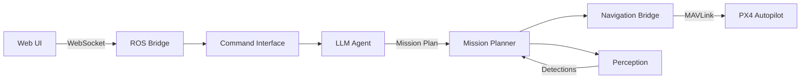

# SkyScout 🚁

> **Transform natural language into autonomous drone missions** - No joysticks, no complex GCS interfaces, just tell your drone what you need.

[](https://github.com/arnenoori/skyscout/actions)
[](https://docs.ros.org/en/iron/)
[](LICENSE)

## 🎯 Vision

SkyScout democratizes drone operations by enabling anyone to command drones using natural language. Whether you're a construction manager needing to "inspect the north wall for cracks" or a farmer wanting to "count livestock in the east pasture," SkyScout translates your intent into safe, autonomous drone missions.

### Key Features

- **🗣️ Natural Language Control**: Command drones with plain English - no technical expertise required
- **🤖 LLM-Powered Intelligence**: Leverages OpenAI/Gemini APIs for understanding complex requests
- **👁️ Real-time Object Detection**: YOLO-based perception for finding and tracking targets
- **🛡️ Safety First**: Built-in geofencing, battery monitoring, weather checks, and automatic return-to-launch
- **🔄 Autonomous Execution**: Converts commands to structured mission plans executed autonomously
- **📱 Web Interface**: Monitor missions with real-time map visualization (dark/light mode)
- **🌤️ Weather Integration**: Real-time weather checks ensure safe flight conditions
- **📋 Mission Templates**: Pre-configured scenarios for common operations (search, inspect, delivery, etc.)
- **✈️ Advanced Flight Patterns**: Grid, spiral, perimeter, zigzag, circle/orbit, and polygon patterns

## 🚀 Quick Demo

```bash
# Example commands SkyScout understands:
"Find all red vehicles in the parking lot using zigzag pattern"
"Inspect the building roof for damage" # Uses circle/orbit pattern
"Count people wearing safety helmets on the construction site"
"Deliver medical supplies to GPS 37.7749, -122.4194"
"Emergency response to accident at main gate"
"Patrol the property perimeter for security"
"Survey the agricultural field for crop health"
"Map the construction site in 3D"
```

## 🏗️ System Architecture



### Hardware Stack
- **Companion Computer**: Raspberry Pi 5 (8GB recommended)
- **Flight Controller**: Pixhawk 6C with PX4
- **Camera**: USB/CSI camera for object detection
- **Drone Platform**: Any PX4-compatible frame

### Software Stack
- **ROS2 Iron**: Robot middleware for component communication
- **Next.js**: Modern web interface for command input
- **OpenAI/Gemini APIs**: Natural language understanding
- **YOLO/RT-DETR**: Real-time object detection
- **PX4**: Professional autopilot firmware

## 🚀 Getting Started

### Option 1: Quick Start with Docker 🐳

```bash
# Clone the repository
git clone https://github.com/arnenoori/skyscout.git
cd skyscout

# Start with Docker Compose
docker-compose up

# Access the web interface at http://localhost:3000
```

### Option 2: Native Installation

#### Prerequisites
- Ubuntu 22.04 or macOS (development only)
- ROS2 Iron
- Node.js 20+
- Python 3.10+
- Git
- OpenAI or Gemini API key
- (Optional) OpenWeather API key for weather integration

#### Step-by-Step Setup

1. **Clone and setup workspace**:
```bash
git clone https://github.com/arnenoori/skyscout.git
cd skyscout
```

2. **Configure API keys**:
```bash
# Create .env file in project root
echo "OPENAI_API_KEY=your-openai-key" >> .env
echo "GEMINI_API_KEY=your-gemini-key" >> .env
# Optional: For weather integration
echo "OPENWEATHER_API_KEY=your-weather-api-key" >> .env
```

3. **Build ROS2 packages**:
```bash
cd ros_ws
source /opt/ros/iron/setup.bash
colcon build --symlink-install
source install/setup.bash
```

4. **Install and start web frontend**:
```bash
cd ../web_frontend
npm install
npm run dev
```

5. **Launch ROS nodes** (in separate terminals):
```bash
# Terminal 1: ROS Bridge
ros2 launch rosbridge_server rosbridge_websocket_launch.xml

# Terminal 2: SkyScout nodes
ros2 launch skyscout_bringup skyscout.launch.py
```

6. **Access the interface**:
   - Open http://localhost:3000 in your browser
   - Enter natural language commands
   - Monitor mission execution in real-time

### Option 3: VS Code DevContainer 💻

For the best development experience:
1. Install [VS Code](https://code.visualstudio.com/) and [Docker](https://docker.com)
2. Open the project in VS Code
3. Click "Reopen in Container" when prompted
4. Everything is pre-configured and ready to go!

## 📦 Core Components

| Component | Description | Key Technologies |
|-----------|-------------|------------------|
| **command_interface** | Receives and validates natural language commands | ROS2, Python |
| **llm_agent** | Converts NL to structured mission plans via LLM APIs | OpenAI/Gemini SDK, Weather API |
| **perception** | Real-time object detection and tracking | YOLO, OpenCV |
| **mission_planner** | Executes missions with advanced flight patterns | State Machine, Python |
| **navigation_bridge** | Interfaces with PX4 for drone control | MAVSDK, MAVLink |
| **web_frontend** | Modern UI with real-time map visualization | Next.js, React, MapLibre GL |

## 🛠️ Development

### Project Structure
```
skyscout/
├── ros_ws/              # ROS2 packages
│   └── src/
│       ├── command_interface/
│       ├── llm_agent/
│       ├── perception/
│       ├── mission_planner/
│       └── navigation_bridge/
├── web_frontend/        # Next.js web interface
├── docs/               # Documentation
├── .devcontainer/      # VS Code dev container
└── .github/            # CI/CD workflows
```

### Running Tests
```bash
# ROS2 tests
cd ros_ws && colcon test

# Frontend tests
cd web_frontend && npm test

# Integration tests
./scripts/run_integration_tests.sh
```

### Code Style
- Python: Black + Ruff (via pre-commit hooks)
- TypeScript: ESLint + Prettier
- Commit messages: Conventional Commits

## 🚁 Flight Safety

### Built-in Safety Features
- **Geofencing**: Configurable boundaries to prevent flyaways
- **Battery Monitoring**: Automatic RTL at configurable thresholds (20-35%)
- **Weather Checks**: Real-time wind, visibility, and precipitation monitoring
- **Obstacle Detection**: Future support for depth cameras
- **Manual Override**: Always maintain RC control as backup
- **Pre-flight Checks**: Automated sensor, GPS, and weather validation
- **Mission Templates**: Pre-validated parameters for common scenarios

### ⚠️ Important Safety Notes
1. Always comply with local drone regulations
2. Maintain visual line of sight during operations
3. Test thoroughly in simulation before real flights
4. Keep RC transmitter ready for manual takeover
5. Never fly over people or restricted areas

## 🤝 Contributing

We welcome contributions! See [CONTRIBUTING.md](CONTRIBUTING.md) for guidelines.

### Current Priorities
1. Improve LLM prompt engineering for better mission planning
2. Add support for more object detection models
3. Implement multi-drone coordination
4. Enhance web UI with 3D visualization
5. Add support for edge TPUs (Coral, Jetson)

## 📄 License

This project is licensed under the MIT License - see [LICENSE](LICENSE) file for details.

## 🙏 Acknowledgments

- ROS2 community for the excellent middleware
- PX4 team for the robust autopilot
- OpenAI/Google for accessible LLM APIs
- All contributors and testers

## 📧 Contact

- **Project Lead**: Arne Noori
- **GitHub Issues**: [Report bugs or request features](https://github.com/arnenoori/skyscout/issues)
- **Discussions**: [Join the conversation](https://github.com/arnenoori/skyscout/discussions)

---

<p align="center">
  Made with ❤️ for the drone community
  <br>
  <a href="https://github.com/arnenoori/skyscout">Star us on GitHub</a>
</p>
