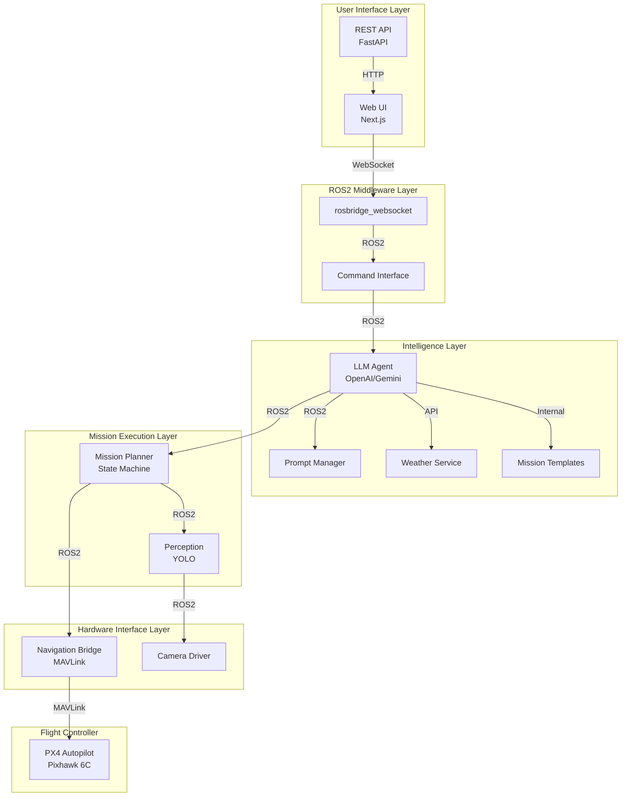
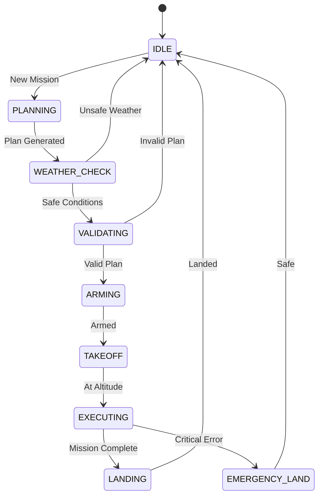
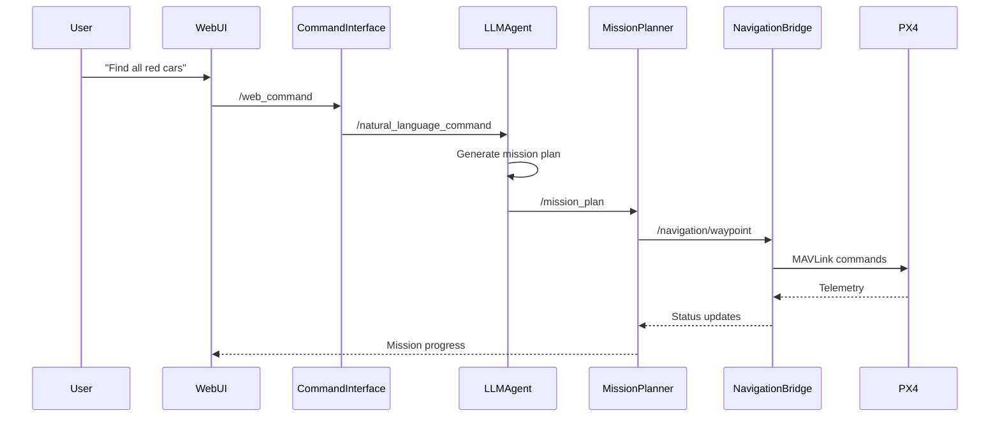
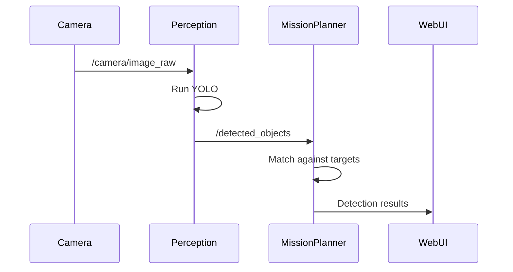
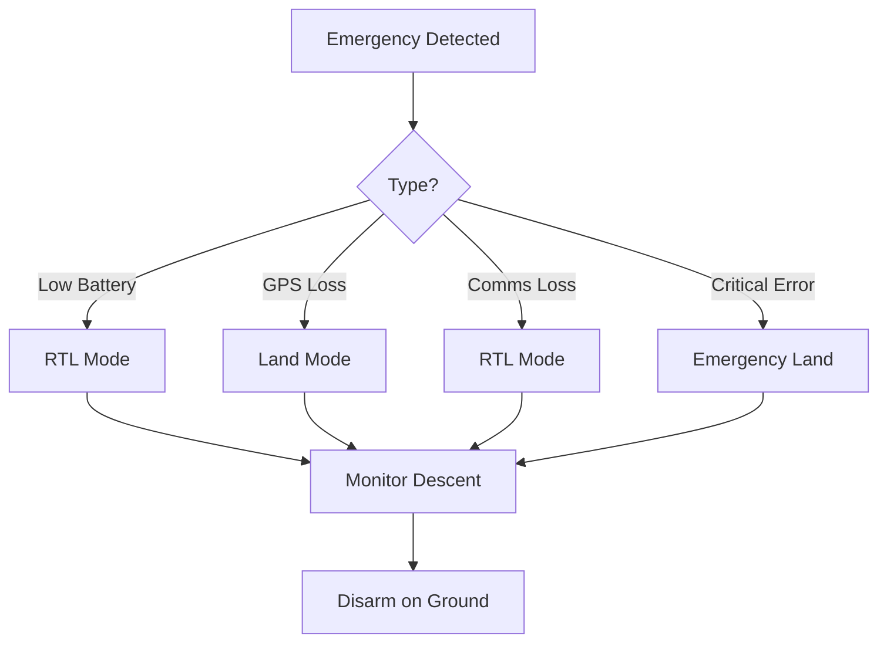

# SkyScout System Architecture 🏗️

This document provides a detailed overview of SkyScout's architecture, component interactions, and design decisions.

## Table of Contents
- [System Overview](#system-overview)
- [Component Architecture](#component-architecture)
- [Data Flow](#data-flow)
- [Communication Protocols](#communication-protocols)
- [LLM Integration](#llm-integration)
- [Safety Architecture](#safety-architecture)
- [Deployment Architecture](#deployment-architecture)

## System Overview

SkyScout follows a modular, microservices-based architecture built on ROS2. The system is designed to be:

- **Scalable**: Easy to add new capabilities or swap components
- **Resilient**: Failures in one component don't crash the system
- **Testable**: Each component can be tested independently
- **Hardware-agnostic**: Works with various drone platforms

### High-Level Architecture



## Component Architecture

### 1. Web Frontend (Next.js)

**Purpose**: User interface for command input and mission monitoring

**Key Features**:
- Real-time mission status updates via WebSocket
- Command history and favorites
- Live video feed display
- Mission result visualization
- System health monitoring

**Technologies**:
- Next.js 14 with App Router
- React Query for data fetching
- roslib.js for ROS communication
- Tailwind CSS for styling

### 2. Command Interface (ROS2 Node)

**Purpose**: Gateway between web UI and ROS2 system

**Responsibilities**:
- Command validation and sanitization
- User session management
- Command queuing and prioritization
- Emergency stop handling

**ROS2 Interfaces**:
```python
# Topics
/web_command (std_msgs/String) - Input
/natural_language_command (std_msgs/String) - Output
/emergency_stop (std_msgs/Bool) - Input

# Services
/get_system_status (custom_msgs/GetSystemStatus)
/cancel_mission (std_srvs/Trigger)
```

### 3. LLM Agent (ROS2 Node)

**Purpose**: Convert natural language to structured mission plans

**Architecture**:
```
┌─────────────────┐
│  Natural Lang   │
│     Input       │
└────────┬────────┘
         │
    ┌────▼────┐
    │ Prompt  │
    │ Template│
    └────┬────┘
         │
    ┌────▼────┐
    │   LLM   │
    │   API   │
    └────┬────┘
         │
    ┌────▼────┐
    │  JSON   │
    │ Parser  │
    └────┬────┘
         │
    ┌────▼────┐
    │Validator│
    └────┬────┘
         │
┌────────▼────────┐
│ Mission Plan    │
│    Output       │
└─────────────────┘
```

**Key Components**:
- Prompt template manager
- API client pool (OpenAI/Gemini)
- Response parser with error handling
- Mission plan validator
- Context memory for multi-turn interactions

### 4. Mission Planner (ROS2 Node)

**Purpose**: Execute mission plans as coordinated drone behaviors

**State Machine Design**:


**Mission Types**:
- **Search**: Grid/spiral/zigzag patterns to find objects
- **Inspect**: Circle/orbit pattern for detailed examination
- **Count**: Systematic enumeration in an area
- **Map**: Create overview/3D model of a region
- **Delivery**: Point-to-point package transport
- **Patrol**: Repeated perimeter monitoring
- **Survey**: Agricultural/land assessment
- **Emergency**: Rapid response with relaxed constraints
- **Follow**: Track and follow moving objects

**Flight Patterns**:
- **Grid**: Back-and-forth systematic coverage
- **Spiral**: Expanding outward from center
- **Perimeter**: Boundary following
- **Zigzag**: Efficient coverage with tighter spacing
- **Circle**: 360° orbit around target
- **Polygon**: Custom shape coverage
- **Waypoints**: Direct path through points

### 5. Perception (ROS2 Node)

**Purpose**: Real-time object detection and tracking

**Processing Pipeline**:
1. Image acquisition from camera
2. Preprocessing (resize, normalize)
3. YOLO inference
4. Post-processing (NMS, filtering)
5. Object tracking (DeepSORT)
6. Result publishing

**Performance Optimizations**:
- Model quantization for Pi 5
- Batch processing when possible
- ROI-based processing
- Adaptive frame rate

### 6. Navigation Bridge (ROS2 Node)

**Purpose**: Interface between ROS2 and PX4 flight controller

**Responsibilities**:
- MAVLink protocol handling
- Waypoint management
- Flight mode control
- Telemetry streaming
- Failsafe coordination

**Safety Features**:
- Geofence enforcement
- Battery monitoring
- GPS quality checks
- RC override detection

## Data Flow

### Command Processing Flow



### Perception Data Flow



## Communication Protocols

### ROS2 Topics

| Topic | Type | Publisher | Subscribers | Description |
|-------|------|-----------|-------------|-------------|
| `/web_command` | String | rosbridge | command_interface | Raw user commands |
| `/natural_language_command` | String | command_interface | llm_agent | Validated commands |
| `/mission_plan` | String | llm_agent | mission_planner | JSON mission plans |
| `/detected_objects` | Detection2DArray | perception | mission_planner | Object detections |
| `/navigation/waypoint` | Point | mission_planner | navigation_bridge | Target positions |
| `/navigation/status` | String | navigation_bridge | mission_planner | Flight status |
| `/weather/current` | String | llm_agent | mission_planner | Weather conditions |
| `/mission_template` | String | llm_agent | web_ui | Available templates |

### WebSocket Protocol

```javascript
// Client -> Server
{
  "type": "command",
  "data": {
    "text": "Find all people wearing helmets",
    "priority": "normal"
  }
}

// Server -> Client
{
  "type": "mission_update",
  "data": {
    "state": "EXECUTING",
    "progress": 0.45,
    "detections": [...]
  }
}
```

## LLM Integration

### Prompt Engineering

The system uses carefully crafted prompts to ensure reliable mission generation:

```python
MISSION_PROMPT_TEMPLATE = """
You are a drone mission planner. Convert the following natural language command into a structured mission plan.

Command: {command}

Context:
- Drone type: Quadcopter
- Max altitude: 120m
- Max range: 500m
- Battery: {battery_percent}%
- Current position: {position}
- Weather: {weather_conditions}
- Wind Speed: {wind_speed} m/s

Generate a JSON mission plan with:
1. mission_type: One of [search, inspect, count, map, delivery, patrol, survey, emergency, follow]
2. target_description: What to look for or do
3. flight_pattern: One of [grid, spiral, perimeter, waypoints, zigzag, circle, polygon]
4. parameters: Including altitude, speed, coverage_area
5. safety: Including geofence, rtl_battery_threshold, weather_check, max_wind_speed

Available Templates:
- quick_search, building_inspection, perimeter_patrol
- delivery_direct, emergency_response, agricultural_survey
- parking_count, 3d_mapping

Ensure the mission is safe and achievable.
"""
```

### Structured Output Validation

```python
class MissionPlanSchema(BaseModel):
    mission_type: Literal["search", "inspect", "count", "map",
                         "delivery", "patrol", "survey", "emergency", "follow"]
    target_description: str
    flight_pattern: Literal["grid", "spiral", "perimeter", "waypoints",
                           "zigzag", "circle", "polygon"]
    parameters: MissionParameters
    safety: SafetyParameters

    @validator('parameters')
    def validate_altitude(cls, v):
        if not 10 <= v.altitude <= 120:
            raise ValueError('Altitude must be between 10-120m')
        return v

class SafetyParameters(BaseModel):
    geofence: Dict[str, float]
    rtl_battery_threshold: int = Field(ge=10, le=50)
    weather_check: bool = True
    max_wind_speed: float = 10.0  # m/s
```

## Safety Architecture

### Multi-Layer Safety System

1. **Application Layer**
   - Mission validation before execution
   - Geofence checking
   - Battery threshold monitoring
   - Weather condition verification
   - Mission template validation

2. **ROS2 Layer**
   - Watchdog timers on all nodes
   - Health monitoring topics
   - Emergency stop service

3. **MAVLink Layer**
   - Failsafe configuration
   - RC override priority
   - GPS loss handling

4. **PX4 Layer**
   - Hardware failsafes
   - Return-to-launch
   - Land immediately modes

### Emergency Procedures



## Deployment Architecture

### Development Environment
- Docker Compose for all services
- Hot reload for frontend and ROS nodes
- Mock MAVLink for testing without hardware

### Production Raspberry Pi
```yaml
# System services
skyscout-ros.service     # ROS2 nodes
skyscout-web.service     # Web frontend
skyscout-bridge.service  # MAVLink bridge

# Resource allocation
ROS nodes: 2GB RAM
Web server: 512MB RAM
System: 1GB RAM
Camera buffer: 512MB RAM
```

### Cloud Integration (Future)
- Mission logging to cloud storage
- Remote monitoring dashboard
- Fleet management capabilities
- Model updates over-the-air

## Performance Considerations

### Raspberry Pi 5 Optimizations
1. **CPU Affinity**: Pin critical processes to specific cores
2. **GPU Acceleration**: Use VideoCore for image preprocessing
3. **Memory Management**: Careful buffer sizing for video
4. **I/O Optimization**: Direct camera access, efficient MAVLink serial

### Latency Budget
- Camera → Detection: <100ms
- Command → Mission Plan: <2s
- Mission Plan → First Waypoint: <500ms
- Total command → drone movement: <3s

## Future Architecture Enhancements

1. **Edge AI Module**
   - Local LLM for offline operation
   - TPU acceleration for perception
   - Federated learning for model improvement

2. **Multi-Drone Coordination**
   - Swarm communication protocol
   - Distributed mission planning
   - Collision avoidance

3. **Advanced Perception**
   - 3D scene understanding
   - Semantic segmentation
   - Active learning for new objects

---

For implementation details of specific components, see the [API Reference](API_REFERENCE.md).
